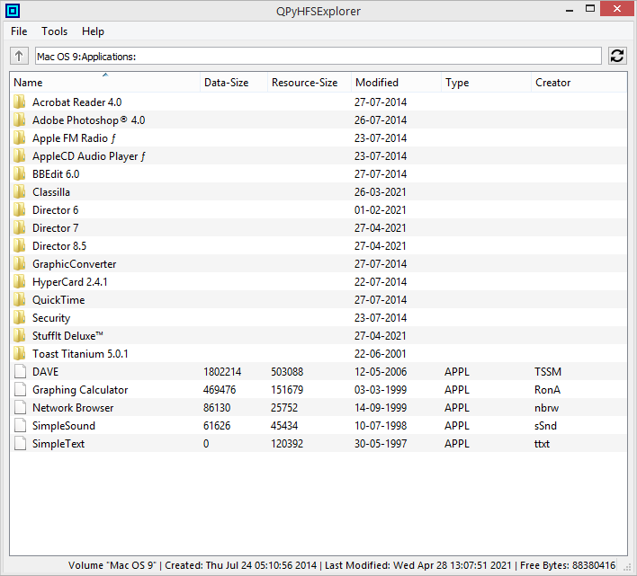
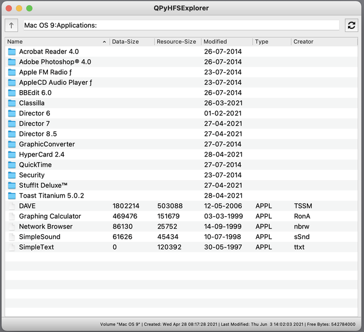

# HFS Utilities for Windows

This is a port of Robert Leslie's [HFS Utilities](https://www.mars.org/home/rob/proj/hfs/) (hfsutils) to Windows and Visual Studio.

**Differences to original hfsutils POSIX version**

* Instead of 14 binaries for the 14 available operations, there is only a single binary "hfs.exe", and the operation is passed as first argument, so e.g. "hfs mount mydisk.dsk" etc. Otherwise the interface is exactly the same as for the original binaries. For convenience, the [Release](Release/Win32/) folders contain 14 single-line CMD scripts that allow to use the original syntax ("hmount mydisk.dsk" etc.).

* This version is fully Unicode aware, file and directory names are mapped from UTF-8 to MacRoman and v.v.

* copy operations in text mode ("-t") also translate from/to UTF-8. To copy-in text files that are already macroman-encoded, use raw mode("-r") instead.

**Python Demo**

Directory [demo_python](demo_python/) contains a simple cross-platform HFS image explorer named "QPyHFSExplorer", based on Python3, PyQt5 and HFS Utilities. While in macOS and Linux the original hfsutils must be installed and in the system path, in Windows an included "hfs.exe" is used. Some extra feature of QPyHFSExplorer is "Fill Empty Space with Zeros", which can be usefull to keep compressed disk images small. Another extra feature - Windows only - is to optionally unstuff copied-in Stuffit archives on the fly, using an included expander.exe.

**Screenshots**

* Python demo "QPyHFSExplorer" in Windows 8.1:

  

* Python demo "QPyHFSExplorer" in macOS 11.4:

  
